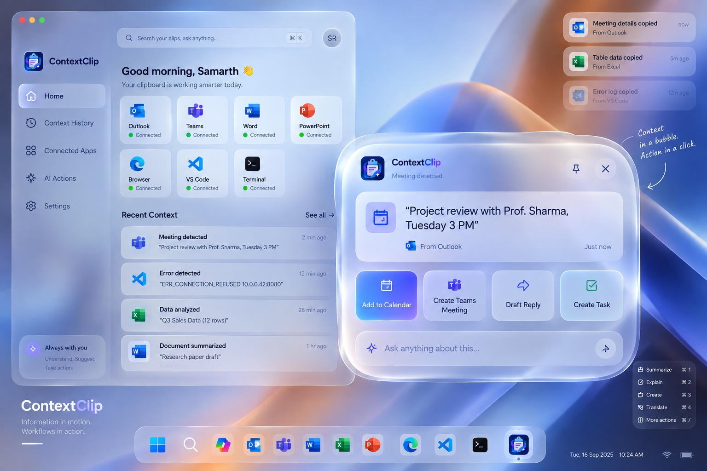

# Coding Agent Instructions

Treat this document as the implementation specification and source of truth for ContextClip v4.

- Preserve the architecture, terminology, interfaces, schemas, state/behavior rules, privacy requirements, acceptance criteria, and implementation order defined below.
- Do not replace the specified event model with a conventional clipboard-manager design.
- Copy and Paste are separate immutable events; each event has its own screenshot.
- Raw local events are canonical. TOON, Markdown, embeddings, and compressed context blocks are derived artifacts.
- Plugins must sit on top of the core event store through the SDK/contracts and must not own storage semantics.
- Build the smallest vertical slice first, following the final implementation instruction in this specification.
- For each implementation task, use the task format defined in Section 18: scope/files/interfaces/behavior/tests/done criteria.
- If an implementation choice is not specified here, choose the smallest architecture-compatible option and document the choice rather than silently changing the contract.

## Source Specification

The complete specification follows, preserving the document's structure and content.


Reference UI direction: ContextClip Windows dashboard + contextual action bubble

ContextClip v4

Implementation specification for a coding agent

A Windows-native workflow memory agent that turns copy/paste into structured, screenshot-backed context and makes that context available to LLMs and application plugins.

| Core idea: COPY and PASTE are first-class events. Every event stores payload metadata + a screenshot snapshot. Events are linked into a Reference Graph, compressed into 7-event context blocks, and serialized as TOON for efficient LLM input. |
| --- |

| Artifact | Purpose |
| --- | --- |
| PRD | Defines product behavior, UX, MVP and acceptance criteria |
| System Design | Defines Windows runtime, storage, event pipeline, cloud compression and plugin architecture |
| Coding Agent Contract | Defines repository structure, interfaces, schemas, state machines, test plan and implementation order |

# 1. Executive Summary

ContextClip is a general-purpose Windows agent whose trigger surface is the clipboard. It observes information moving between applications and reconstructs the workflow around that movement. The product is not a clipboard manager and not a chat client; it is a local workflow memory layer with optional cloud reasoning and app-specific actions.

The coding agent must implement the system around five primitives: Event, Screenshot, Reference, Workflow Edge, and Context Block. Everything else — AI suggestions, plugins, statistics, Markdown export, and the UI — is built on these primitives.

| Non-negotiable behavior: a copy event and a paste event are separate events. Each event has its own screenshot. The system must never collapse copy+paste into one event because the destination application and visual state are part of the workflow meaning. |
| --- |

## 1.1 Product outcome

- When the user presses Ctrl+C, ContextClip records what moved, where it came from, and what the screen looked like at that moment.

- When the clipboard content is pasted, ContextClip records the destination and a second screenshot, then links the two events.

- The current workflow remains queryable as a graph even after the clipboard content has changed.

- Every 7 events form a context window. The cloud model compresses that window into a durable context block. A rolling window then begins with the next event.

- The user can copy the active seven-event context as Markdown for use in ChatGPT, Claude, an IDE agent, or a ticket/document.

- Plugins contribute app-specific context and actions without owning the core event store.

## 1.2 What the coding agent is building

The implementation is a Windows desktop shell plus background service, local event store, screenshot store, workflow graph, plugin host, cloud context service, contextual overlay, and settings/dashboard experience. The initial plugin set is Outlook, Teams, Word, PowerPoint, VS Code/IDE, Browser, and Terminal.

# 2. Product Behavior / UX Contract

## 2.1 Main activation flow

```text
User presses configurable global hotkey (default: Win+Shift+C)
        |
        v
ContextClip main window opens
        |
        +--> copy/paste stats
        +--> most-connected apps
        +--> current workflow
        +--> latest 7 events / compressed context blocks
        +--> Plugins
        +--> Hotkeys / Actions
```

The hotkey is the primary control surface for the dashboard. Background capture is always event-driven by clipboard changes and plugin signals, not by opening the dashboard.

## 2.2 Main interface

| Region | Required UI |
| --- | --- |
| Header | Search clips / ask anything, profile, capture status, quick settings |
| Sidebar | Home, Context History, Connected Apps, AI Actions, Settings |
| Stats cards | Copies today, pastes today, active workflow length, connected apps |
| App map | Apps most often connected by copy/paste edges; click to filter |
| Current context | Last seven events with type, app, title, screenshot thumbnail and relation |
| Compressed blocks | Context Block 01, 02... with Copy Markdown and Inspect actions |
| Plugins | Installed plugins, permissions, health, Add Plugin |
| Hotkeys | Global hotkey and per-action hotkeys; conflict status |
| Context bubble | Appears near current app after high-confidence copy/paste; 1-3 actions max |

## 2.3 Context bubble

The contextual bubble is intentionally smaller than the main UI. It should answer only three questions: What did ContextClip notice? Why does it matter? What can it do now?

```text
ContextClip
Meeting detected
“Project review with Prof. Sharma, Tuesday 3 PM”

[Add to Calendar] [Create Teams Meeting] [Draft Reply] [Create Task]

[Ask anything about this…]
```

# 3. Event Semantics

## 3.1 Canonical event model

An Event is immutable. Corrections are modeled as annotations or derived events. The original event must remain auditable so the workflow graph can be rebuilt.

```text
Event {
  id: EventId,
  seq: int64,
  type: Copy | Paste,
  timestampUtc: instant,
  sourceApp: AppRef,
  destinationApp?: AppRef,
  clipboard: ClipboardRef,
  screenshot: ScreenshotRef,
  window: WindowContext,
  pluginContext?: PluginContextRef,
  entities: EntityRef[],
  workflowId?: WorkflowId,
  parentEventId?: EventId,
  confidence: float,
  privacyClass: Public | Sensitive | Restricted
}
```

## 3.2 Copy event

A copy event is created only after the clipboard content becomes available and is successfully correlated with a user copy gesture or equivalent clipboard-origin signal. It captures the source app and current visual state.

```text
Copy Event
  payloadHash
  payloadType (text|html|image|file-list|rich-text)
  normalizedPreview
  sourceApp
  sourceWindowTitle
  activeDocument/page/tab metadata
  screenshot
  selected region if available
  detected entities / content type
  timestamp
```

## 3.3 Paste event

A paste event is created when ContextClip can correlate clipboard consumption with the foreground destination app. For apps without direct paste instrumentation, use a short temporal + content correlation window and mark the event as inferred.

```text
Paste Event
  clipboardHash
  destinationApp
  destinationWindowTitle
  destinationDocument/tab
  pasteMode = observed | inferred
  screenshotAfterPaste
  timestamp
  sourceEventId (best match)
```

## 3.4 Screenshots are context, not surveillance

| Capture is event-scoped. Do not record a continuous desktop video stream. The screenshot pipeline should capture a window/tab or relevant region at the event boundary and should apply privacy policy before cloud upload. |
| --- |

# 4. ReferenceStack + ReferenceGraph

ReferenceStack is the ordered human-facing sequence. ReferenceGraph is the semantic structure used for retrieval, deduplication and workflow reconstruction.

```text
ReferenceStack
R1  Copy  VS Code      error.log        screenshot-1
R2  Paste Browser      search result    screenshot-2
R3  Copy  Browser      docs snippet     screenshot-3
R4  Paste Word         troubleshooting  screenshot-4
R5  Copy  Word         command          screenshot-5
R6  Paste VS Code      terminal         screenshot-6

ReferenceGraph
R1 --searched_for--> R2
R2 --contains--> R3
R3 --pasted_into--> R4
R4 --solution_for--> R1
R5 --derived_from--> R4
R5 --pasted_into--> R6
```

## 4.1 Graph edge types

| Edge | Meaning | How inferred |
| --- | --- | --- |
| copied_from | Reference came from an app/document context | Plugin context |
| pasted_into | Copy content was consumed in destination | Direct or temporal inference |
| searched_for | User moved from a problem into search/research | Browser search correlation |
| derived_from | New text was produced from a previous reference | Similarity + app action |
| solves | Reference appears to answer an earlier problem | LLM/entity relation; confidence-scored |
| same_thread | Events belong to the same workflow | Temporal + app + semantic score |
| follows | Sequential workflow progression | Sequence adjacency |

## 4.2 Workflow identity

A workflow episode is a soft boundary, not a hard session. Start a new workflow when semantic similarity, inactivity and app transition signals indicate the user changed tasks. Keep explicit links when evidence exists across longer gaps.

```text
workflowId = cluster(events, time_decay, semantic_similarity, app_transition, entity_overlap)
```

# 5. 7-Event Rolling Context + TOON Strategy

## 5.1 Window behavior

The active user-visible context window contains the most recent seven events. When event 7 is committed, the cloud context service creates a compressed context block. Events 1-7 remain queryable locally. The active window then advances to events 8-14, and so on.

```text
events 1..7   -> ContextBlock-001.md / .toon
events 8..14  -> ContextBlock-002.md / .toon
events 15..21 -> ContextBlock-003.md / .toon
```

Do not delete the raw events after compression. Compression is a derived representation. The local store remains the source of truth for replay and audit.

## 5.2 Why TOON

Use TOON as the LLM serialization layer, not as the application database format. TOON is designed as a compact, human-readable encoding of the JSON data model for LLM prompts and is especially efficient for uniform arrays. The official project currently documents the format as Token-Oriented Object Notation and publishes a current v4 line; use a pinned implementation and conformance tests rather than inventing a private dialect. (TOON official documentation and specification: toonformat.dev and github.com/milanjaros/toon-format-spec)

| Rule: JSON/domain objects internally -> TOON at the LLM boundary -> model response -> validated JSON/domain objects again. Never make TOON the canonical persistence format. |
| --- |

## 5.3 Recommended TOON payload

```text
window[7]{id,type,time,app,target,summary,hash}:
  e101,copy,10:02,VSCode,error.log,ECONNREFUSED,sha256:aa
  e102,paste,10:03,Browser,Search,search error,sha256:aa
  e103,copy,10:04,Browser,Docs,start api,sha256:bb
  ...
workflow:
  id:w42
  goal:debug local api
  links[3]:e101->e102,e102->e103,e103->e106
```

## 5.4 Compression output contract

```text
ContextBlock {
  id,
  workflowId,
  eventStart, eventEnd,
  title,
  oneLineGoal,
  narrative,
  importantEntities[],
  decisions[],
  openQuestions[],
  appTransitions[],
  eventIds[],
  sourceHashes[],
  createdAt,
  modelInfo,
  safetyRedactions[]
}
```

# 6. User-Copyable Markdown Contract

The user-facing export is Markdown, even though the internal LLM request is TOON. This makes the same context usable with external AI tools and documentation workflows.

```text
## ContextClip Context Block 002
Workflow: Debug local API
Events: 8-14
Apps: VS Code -> Browser -> Word -> VS Code

### Goal
Resolve ECONNREFUSED on localhost:8080.

### Timeline
1. VS Code copy: error message ...
2. Browser paste/search: ...
3. Browser copy: troubleshooting instruction ...
4. Word paste: troubleshooting note ...
5. Word copy: docker command ...
6. VS Code paste: docker command ...

### Screenshots
- [event-08](contextclip://screenshot/e08) VS Code error
- [event-09](contextclip://screenshot/e09) search results
...

### Current state
Likely fix: start API container and verify port 8080.

### Open questions
- Is the API container healthy?
- Is port 8080 exposed?
```

## 6.1 Export actions

| Action | Result |
| --- | --- |
| Copy active context | Copies Markdown for current 7 events |
| Copy compressed block | Copies the selected historical block |
| Copy workflow | Copies merged Markdown across selected context blocks |
| Copy for LLM | Copies compact Markdown + optional TOON payload hint |
| Export files | Writes .md plus manifest.json and screenshot index |

# 7. Windows Application Architecture

```text
                         ContextClip.exe / WinUI 3
                                |
            +-------------------+-------------------+
            |                                       |
     Desktop UI / Shell                       Overlay UI
            |                                       |
            +-------------------+-------------------+
                                |
                    Local Agent Service
                                |
       +------------+-----------+-----------+-------------+
       |            |                       |             |
 Clipboard      Event Store          Plugin Host      Agent Core
 Capture        + Screenshot         (isolated)       + Retrieval
       |            |                       |             |
       +------------+-----------+-----------+-------------+
                                |
                         Cloud Context API
                                |
                     Model / TOON Compressor
```

## 7.1 Process model

| Process | Responsibility | Trust boundary |
| --- | --- | --- |
| ContextClip UI | Dashboard, history, settings, plugin marketplace/local installer | User-facing |
| ContextClip Agent | Clipboard listener, event correlation, screenshot orchestration | High privilege, local-only |
| Plugin Host | Runs third-party plugin adapters | Untrusted extension boundary |
| Browser Bridge | Browser extension + native messaging host | Browser trust boundary |
| Cloud Context API | Optional compression/reasoning; returns derived context | Network boundary |

## 7.2 Technology baseline

| Layer | Choice |
| --- | --- |
| Windows shell | C# / .NET 8+ / WinUI 3 / Windows App SDK |
| Local storage | SQLite; FTS5 for text; append-only event tables |
| Screenshot | Windows Graphics Capture / app-specific tab capture |
| Plugin IPC | Named pipes + versioned JSON RPC contract |
| Cloud API | ASP.NET Core Web API or equivalent stateless service |
| Model boundary | Provider-neutral adapter; TOON serializer |
| Browser | Chromium extension + native messaging; Edge first |
| VS Code | TypeScript extension |
| Office | Office.js add-ins + Microsoft Graph where appropriate |

# 8. Codebase Layout

```text
contextclip/
  apps/
    windows-shell/                 # WinUI 3 dashboard + tray + overlay
    agent-service/                 # Windows background service
    plugin-host/                   # isolated plugin runtime
    browser-native-host/           # native messaging bridge
  plugins/
    outlook/                       # mail/calendar context + actions
    teams/                         # chat/channel context + actions
    word/                          # selection/document context + actions
    powerpoint/                    # slide/selection context + actions
    vscode/                        # extension package
    browser/                       # Chromium/Edge extension
    terminal/                      # shell command / output context
  core/
    contracts/                     # shared domain contracts
    eventing/                      # event bus + correlation
    capture/                       # clipboard + screenshot capture
    graph/                         # ReferenceGraph
    memory/                        # ReferenceStack + context windows
    retrieval/                     # ranking + workflow assembly
    privacy/                       # classification + redaction
    hotkeys/                       # global/per-action hotkey registry
    actions/                       # ActionBroker + capability checks
  storage/
    sqlite/                        # migrations, repositories, FTS5
    blobs/                         # screenshot/content blobs
  cloud/
    api/                           # context compression endpoints
    serializer/                    # JSON <-> TOON
    model-adapters/                # OpenAI/other provider adapters
    prompt-templates/              # compression + action reasoning prompts
  sdk/
    plugin-sdk/                    # public developer SDK
    plugin-schema/                 # JSON schemas + examples
  tests/
    unit/
    integration/
    e2e/
    fixtures/
    security/
  docs/
    architecture/
    plugins/
    api/
    demo/
  infra/
    local-dev/
    cloud/
  README.md
```

## 8.1 Layering rule

| UI code may depend on application services. Application services may depend on core contracts. Core must not depend on WinUI, a specific model vendor, or a specific plugin. Plugins depend on SDK interfaces, never on SQLite internals. |
| --- |

# 9. Core Interfaces for the Coding Agent

## 9.1 Event capture

```text
public interface IEventCapture
{
    Task<EventId> RecordCopyAsync(CopyObservation observation, CancellationToken ct);
    Task<EventId> RecordPasteAsync(PasteObservation observation, CancellationToken ct);
}

public interface IScreenshotCapture
{
    Task<ScreenshotRef> CaptureAsync(CaptureTarget target, CapturePolicy policy, CancellationToken ct);
}
```

## 9.2 Context window

```text
public interface IContextWindow
{
    Task<IReadOnlyList<Event>> GetActiveEventsAsync(WorkflowId workflow, CancellationToken ct);
    Task<ContextBlock> CompressAsync(IReadOnlyList<Event> events, CancellationToken ct);
    Task<string> ExportMarkdownAsync(ContextBlock block, CancellationToken ct);
}
```

## 9.3 Graph

```text
public interface IReferenceGraph
{
    Task AddNodeAsync(ReferenceNode node, CancellationToken ct);
    Task AddEdgeAsync(ReferenceEdge edge, CancellationToken ct);
    Task<IReadOnlyList<ReferenceEdge>> GetNeighborsAsync(EventId id, int depth, CancellationToken ct);
    Task<WorkflowGraph> GetWorkflowAsync(WorkflowId workflowId, CancellationToken ct);
}
```

## 9.4 Actions

```text
public interface IActionBroker
{
    IReadOnlyList<ActionDescriptor> Discover(ContextEnvelope context);
    Task<ActionResult> ExecuteAsync(ActionRequest request, CancellationToken ct);
}

public record ActionDescriptor(
    string Id, string PluginId, string Name,
    string[] RequiredCapabilities, float Confidence);
```

## 9.5 Plugin contract

```text
public interface IContextClipPlugin
{
    PluginManifest Manifest { get; }
    Task<PluginContext?> EnrichAsync(AppContext app, EventTrigger trigger, CancellationToken ct);
    Task<IReadOnlyList<ActionDescriptor>> GetActionsAsync(ContextEnvelope context, CancellationToken ct);
    Task<ActionResult> ExecuteAsync(ActionRequest request, CancellationToken ct);
    Task<HealthStatus> HealthAsync(CancellationToken ct);
}
```

# 10. Plugin SDK Contract

## 10.1 Plugin manifest

```text
{
  "id": "com.contextclip.vscode",
  "name": "VS Code",
  "version": "1.0.0",
  "protocolVersion": 1,
  "capabilities": [
    "read.selection", "read.activeDocument", "read.diagnostics",
    "read.terminal", "action.openFile", "action.insertText"
  ],
  "triggers": ["copy", "paste", "focus"],
  "healthCheck": "named-pipe://..."
}
```

## 10.2 Starter plugin responsibilities

| Plugin | Must provide context | Demo actions |
| --- | --- | --- |
| Outlook | subject, sender, selected body, meeting details | Add Calendar, Draft Reply, Create Task |
| Teams | message, thread, channel/chat identity | Reply, Create Meeting, Extract Tasks |
| Word | document title, heading, selected text, page position | Explain, Rewrite, Insert Summary |
| PowerPoint | presentation title, slide number, selected text/shape | Rewrite Slide, Speaker Notes, Summarize |
| VS Code / IDE | file, language, diagnostics, selected code, terminal tail | Diagnose, Explain, Generate Patch |
| Browser | URL, title, selection, search query, page metadata | Summarize, Search Related, Save Reference |
| Terminal | shell, command, stderr/stdout tail, working dir | Diagnose, Retry, Explain Output |

## 10.3 Plugin permission model

```text
read.clipboard
read.window.metadata
read.screen.capture
read.app.selection
read.document
read.terminal
action.insert
action.open
action.create
network.outbound
cloud.upload
```

Every permission is user-visible. Plugins start with least privilege. High-impact actions require explicit confirmation unless the user has created a trusted automation rule.

# 11. Event Correlation + Workflow Inference

## 11.1 Paste correlation algorithm

```text
On clipboard change:
  1. fingerprint payload
  2. read foreground app/window
  3. start short paste-correlation timer
  4. ask capable plugin for paste observation
  5. detect destination clipboard consumer if possible
  6. capture destination screenshot
  7. create Paste Event
  8. attach sourceEventId by hash + time + workflow score
  9. append ReferenceEdge(pasted_into)
```

## 11.2 Workflow scoring

```text
score =
  0.35 * semantic_similarity
+ 0.20 * entity_overlap
+ 0.15 * time_proximity
+ 0.15 * app_transition_pattern
+ 0.10 * paste_linkage
+ 0.05 * document_overlap
```

Use the score only for clustering and retrieval. Never mutate the underlying events based on a model guess.

## 11.3 Deduplication

Compute a cryptographic hash of the normalized clipboard payload. Keep screenshot hashes separately. Duplicate copies are still events if they represent distinct user actions; deduplication should collapse storage payloads, not behavioral history.

# 12. Cloud Context Compression Service

```text
POST /v1/context/compress
Content-Type: application/json

{
  "workflowId": "w42",
  "events": [ ... 7 events ... ],
  "graph": { ... relevant edges ... },
  "screenshots": [signed refs / OCR-free metadata],
  "output": "context-block-v1"
}
```

## 12.1 Pipeline

```text
Local event window
      -> policy filter
      -> compact domain JSON
      -> TOON encoder
      -> model prompt
      -> structured model output
      -> schema validator
      -> safety/redaction pass
      -> ContextBlock
      -> local persistence
```

## 12.2 Model instructions

- Summarize the user workflow, not individual screenshots unless the visual state changes meaning.

- Preserve exact technical identifiers, commands, URLs and error strings when safe.

- Distinguish observed facts from inferred intent.

- Do not invent an app transition or action that was not present in the events.

- Return event IDs for every claim that came from a specific event.

- Return a compact narrative optimized for later retrieval, not a conversational answer.

## 12.3 Cloud boundary

The local service decides what data may leave the device. Cloud upload is opt-in and policy-controlled. Sensitive screenshots should be redacted or excluded before upload. Model providers must be replaceable through an adapter interface.

# 13. Local Storage Schema

```text
events
- id PK
- seq UNIQUE
- workflow_id INDEX
- type
- timestamp_utc
- source_app_id
- destination_app_id NULL
- payload_hash
- preview_text
- screenshot_id
- plugin_context_json
- privacy_class
- confidence

screenshots
- id PK
- sha256 UNIQUE
- local_path
- width
- height
- created_at
- retention_class

references
- event_id PK/FK
- entity_type
- entity_value_hash
- label

graph_edges
- id PK
- from_event_id
- to_event_id
- relation
- score
- source

context_blocks
- id PK
- workflow_id
- event_start
- event_end
- title
- summary
- toon_payload
- markdown_payload
- model_info_json
- created_at

plugins
- id PK
- version
- state
- permissions_json
- config_json
- last_health

hotkeys
- id PK
- command_id
- accelerator
- enabled
```

## 13.1 Storage rule

| Canonical storage is relational + blobs. TOON, Markdown and embeddings are derived artifacts. The system must be able to delete or rebuild any derived artifact from the raw event store. |
| --- |

# 14. Security, Privacy, Reliability

## 14.1 Security requirements

- Run third-party plugins out-of-process with capability-based permissions.

- Encrypt local secrets and cloud credentials using Windows Credential Manager / DPAPI-backed storage.

- Sign or validate plugin manifests before installation.

- Do not upload screenshots, clipboard payloads or app metadata unless the active privacy policy permits it.

- Use signed URLs or short-lived handles for cloud screenshot references; never expose local paths.

- Maintain an audit log for plugin actions and user-approved AI actions.

## 14.2 Privacy controls

| Control | MVP behavior |
| --- | --- |
| Pause capture | Global hotkey + tray command |
| Excluded apps | Regex/package ID list; capture disabled entirely for matches |
| Sensitive patterns | Detect secrets/credentials; mark Restricted and block cloud upload |
| Screenshot policy | Window/region only; no continuous recording |
| Retention | Default 30 days raw events; configurable; compressed blocks retained separately |
| Cloud toggle | Off by default for screenshot payloads in demo |

## 14.3 Reliability

Clipboard capture must tolerate clipboard lock contention, apps exiting mid-event, malformed rich text, oversized images, plugin timeouts, cloud outages and model schema failures. The event should still be recorded locally even if enrichment or compression fails.

# 15. Coding Agent Implementation Plan

## Phase 0 — Repository bootstrap

- Create solution/workspace from the repository layout.

- Add CI: build, unit tests, lint, schema validation, package signing checks.

- Add migrations + seed fixtures for a 20-event demo workflow.

- Implement feature flags for cloud compression, screenshot capture and plugins.

## Phase 1 — Clipboard + screenshots

- Implement Windows clipboard listener.

- Implement Ctrl+C correlation and clipboard payload normalization.

- Implement event-scoped screenshot capture.

- Persist Copy events with screenshot references.

- Build event replay test harness.

## Phase 2 — Paste + graph

- Implement paste observation for first-party plugins.

- Implement hash/time/source correlation.

- Implement ReferenceStack and ReferenceGraph.

- Implement workflow clustering and event browser.

## Phase 3 — Windows UX

- Implement dashboard from the supplied visual direction.

- Implement global hotkey registration.

- Implement contextual overlay.

- Implement stats, app graph and current 7-event view.

- Implement copy-as-Markdown actions.

## Phase 4 — TOON + cloud compressor

- Add provider-neutral model adapter.

- Implement JSON -> TOON serializer.

- Create compression prompt + output schema.

- Implement 7-event block creation and rotation.

- Implement Markdown reconstruction from validated block.

## Phase 5 — Plugins + demo

- Build VS Code and Browser first.

- Build Word and Outlook next.

- Add Teams and PowerPoint.

- Add Terminal for debugging demo context.

- Finish action broker + confirmation UX.

# 16. Golden Demo Scenario

The demo should tell one continuous story, not six disconnected integrations.

```text
1. VS Code
   User copies: ERR_CONNECTION_REFUSED 10.0.0.42:8080
   -> Event 01 Copy + VS Code screenshot

2. Browser
   User pastes/searches the error
   -> Event 02 Paste + Browser screenshot

3. Browser
   User copies the useful documentation snippet
   -> Event 03 Copy + Browser screenshot

4. Word
   User pastes the snippet into a troubleshooting document
   -> Event 04 Paste + Word screenshot

5. Word
   User copies the final docker command from the doc
   -> Event 05 Copy + Word screenshot

6. VS Code
   User pastes the command into terminal/config
   -> Event 06 Paste + VS Code screenshot

7. VS Code
   User copies the successful output
   -> Event 07 Copy + VS Code screenshot

      => cloud compression => ContextBlock-001

8. ContextClip dashboard
   User opens hotkey -> sees workflow + stats + compressed block
   User clicks “Copy Markdown”

9. External LLM
   User pastes the Markdown context
   -> LLM understands the full journey without seven separate screenshots/prompts
```

## 16.1 Demo action bubble

```text
ContextClip
Workflow: Debug local API
7 related events across VS Code -> Browser -> Word -> VS Code

[Summarize] [Explain Fix] [Copy Context as Markdown] [More Actions]
```

## 16.2 What success looks like

The audience should understand in under two minutes that ContextClip remembers how information moved, not just what information was copied. The strongest proof is the reconstructed VS Code -> Browser -> Word -> VS Code workflow and the compact context block that can be handed to an external LLM.

# 17. Acceptance Criteria

| Area | Acceptance test |
| --- | --- |
| Copy event | Ctrl+C produces one immutable Copy Event with source app and screenshot |
| Paste event | Paste produces one immutable Paste Event with destination app and screenshot |
| Graph | Copy/paste relation is queryable as a graph edge |
| Rolling window | Exactly seven most recent events are shown as active context |
| Compression | After event 7, a ContextBlock is generated without deleting raw events |
| TOON | LLM requests serialize eligible structured data through TOON |
| Markdown | User can copy current block as readable Markdown |
| Dashboard | Hotkey opens dashboard with stats, apps, recent context and plugin/hotkey controls |
| Plugins | Install/disable plugin without changing core event store code |
| Action safety | High-impact action requires confirmation and capability permission |
| Offline | Capture and local storage continue when cloud/model is unavailable |
| Privacy | Excluded apps generate no clipboard/screenshot events |

## 17.1 Performance targets for demo build

| Metric | Target |
| --- | --- |
| Clipboard event persistence | < 150 ms P95 |
| Screenshot capture | < 500 ms P95 |
| Overlay appearance | < 400 ms after event enrichment |
| Dashboard launch from hotkey | < 700 ms warm start |
| Local search | < 150 ms P95 for 30-day demo dataset |
| Cloud compression | Async; UI must never block on model |

# 18. Coding Agent Task Format

Each implementation task should be written so a coding agent can execute it without inferring architecture. The task must declare scope, files, interfaces, tests and done criteria.

```text
TASK: Implement Copy Event Capture

Goal
Record one immutable event when user copies data.

Files
- core/contracts/Event.cs
- core/capture/ClipboardListener.cs
- core/capture/CopyCorrelator.cs
- storage/sqlite/EventRepository.cs

Behavior
- Listen for clipboard changes.
- Correlate with Ctrl+C when possible.
- Normalize text/HTML/file-list/image payloads.
- Capture foreground window metadata.
- Capture event-scoped screenshot.
- Persist event atomically.

Tests
- unit: text normalization
- unit: clipboard lock retry
- integration: copy fixture creates event
- integration: screenshot reference exists
- security: excluded app creates no event

Done when
- build passes
- tests pass
- event replay fixture is green
- no UI thread blocking
```

## 18.1 Definition of done

- Code compiles with warnings treated according to repository policy.

- Unit + integration tests cover the happy path and failure path.

- Interfaces remain dependency-inverted and provider-neutral.

- Telemetry contains no raw clipboard payload by default.

- A replay fixture can reproduce the behavior deterministically.

- Documentation is updated for any public SDK contract change.

# 19. Future Extensibility

The architecture intentionally makes the event pipeline app-agnostic. Future integrations should add context providers and actions, not new storage semantics.

| Future plugin | Example context/actions |
| --- | --- |
| Excel | table selection, formulas, data ranges; analyze/format/chart |
| Slack | message/thread; reply/summarize/create task |
| GitHub | issue/PR/code review; summarize/fix/draft response |
| Jira | issue; update status/create task/link reference |
| Notion | page/database; insert summary/link references |
| Figma | design selection; explain/spec/comment |

| Platform thesis: ContextClip should become an interoperability layer for information in motion. The clipboard is the universal trigger; plugins add semantics; the ReferenceGraph preserves the journey; the LLM turns that history into useful action. |
| --- |

# 20. Technical References

TOON reference: the current project describes Token-Oriented Object Notation as a compact, human-readable encoding of the JSON data model designed for LLM input. The official documentation also describes schema-aware/tabular representations and a current v4 line. Pin the exact encoder version in the implementation and run the project conformance tests before upgrading. (TOON official documentation and specification: toonformat.dev and github.com/milanjaros/toon-format-spec)

Windows clipboard reference: implement the listener using the Windows clipboard notification mechanisms appropriate for a desktop application. Screenshot capture should use event-scoped Windows capture APIs or application-specific integrations rather than continuous recording.

Reference UI: the supplied image is treated as visual direction for dashboard composition, app cards, recent context, contextual bubble, navigation and action affordances. The coding agent must preserve the interaction model while using the system architecture in this document as the source of truth.

## Final instruction to the coding agent

| Build the smallest vertical slice that proves the full architecture: VS Code copy -> screenshot -> Browser paste -> screenshot -> Word copy/paste -> VS Code paste -> seven-event block -> TOON compression -> Markdown export -> dashboard visualization -> one action plugin. Do not start by implementing every plugin. Prove the event model and graph first; plugins must sit on top of it. |
| --- |


## Visual Assets

The original DOCX contains one embedded visual asset, extracted into `assets/`:

- `assets/image_1.jpeg` — page 1 UI reference: ContextClip Windows dashboard + contextual action bubble.

### UI Reference — Page 1



The architecture diagram shown on page 8 is represented directly in the source document's rendered page and its surrounding written architecture section; there is no separate embedded image asset in the DOCX package.

**Important:** the image is reference material, not a substitute for the written contracts. Preserve the interaction model shown in the UI reference, while treating the written architecture and interfaces as the source of truth.

## Agent Note on the Embedded UI Reference

The original DOCX contains a visual reference on page 1 and an architecture diagram on page 8. The page-1 image is visual direction for the Windows dashboard and contextual action bubble; the written system architecture remains the source of truth. The page-8 diagram shows the WinUI 3 shell/overlay, local agent service, clipboard/event/screenshot/plugin components, cloud context API, and model/TOON compressor.
